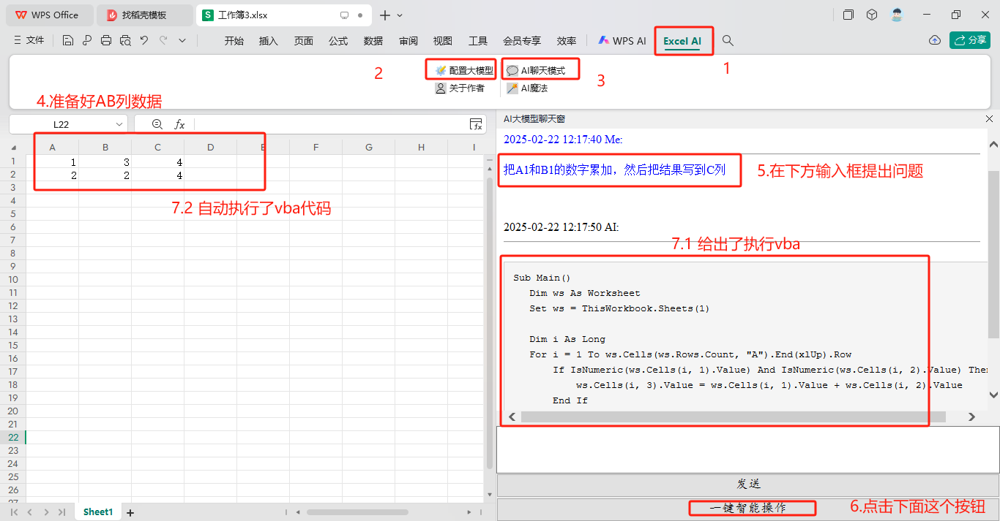
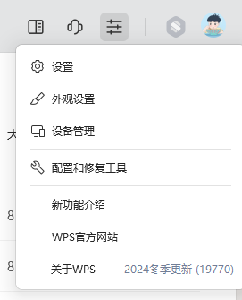
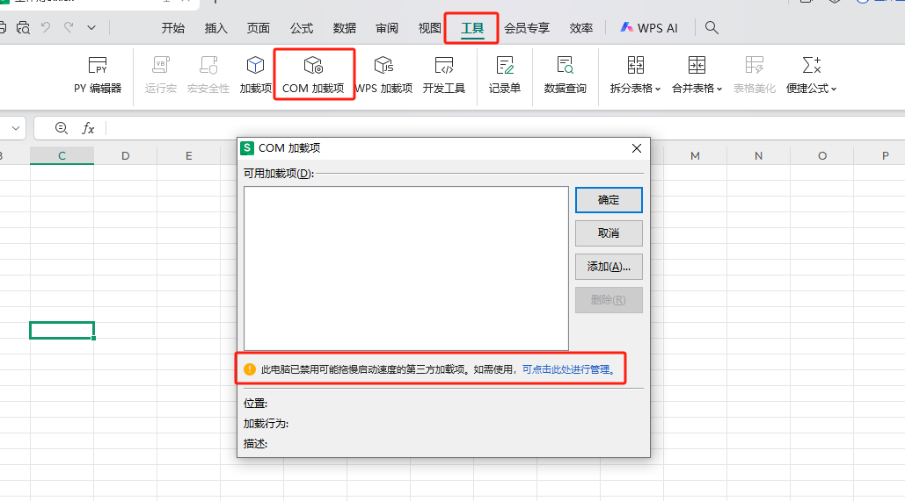
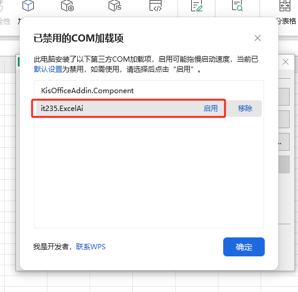
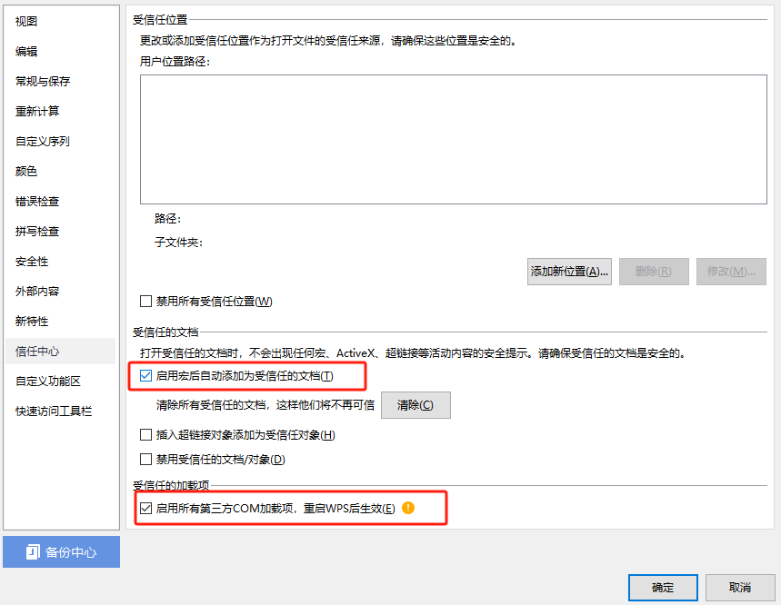
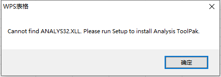
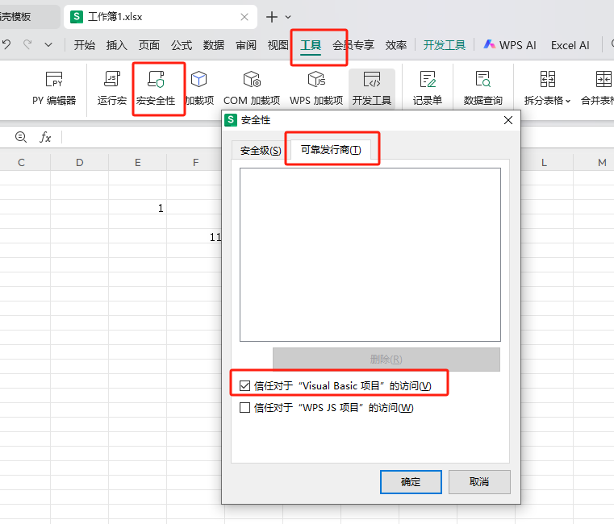
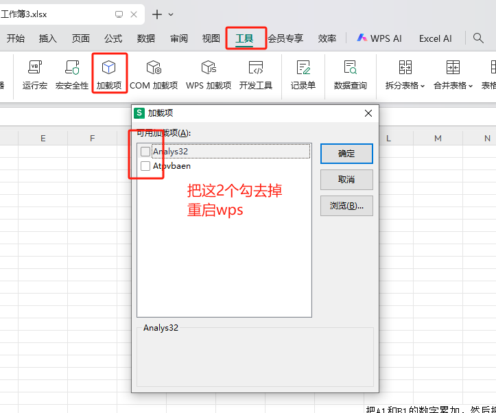

## WPS自身限制，导致插件的AI聊天模式用不了的解决方案

>  真的很搞，尤其是对小白用户极度不友好，我花了点时间总结了以下几个点


## 先看wps最终效果



## 配置开搞

### 我的版本

2024冬季更新（19770）



2025-03-06日 我又下载了“2025春季更新20305”

### 没有注册类提示

请在信任中心开启信任VBA或启用第三方加载项，重启后生效


### 安装插件

请安装目录中的`ExcelAi.exe`，如果有安全软件拦截可以点击允许所有操作，或先暂时退出安全软件

## 启动com加载项

安装好插件后，顶部没有出现`Excel Ai`一般是`COM加载项`被禁用，需要启用







到这里，你重启后，应该就能看到Excel Ai的Tab栏了，但是这里还不能真正执行自然语言，还需要继续往下看。

## 安装WPS-VBA支持

由于WPS个人版（即非专业版、企业版）是无法操作VBA的，如果你自己调用Excel Ai聊天的智能解析会出现如下异常：

```text
执行 VBA 代码时出错: 对 COM 组件的调用返回了错误 HRESULT E_FAIL。
```


接下来我们继续，下载当前目录中的`wpsvba7.0.exe`，我不能确保你们所有人都能用这个版本，但是可以试试，不行就只能下载其他对应版本，或者升级你们的wps和我一样。

### Cannot find ANALYS32.XLL

安装完成后打开WPS会出现如下错误，但是不要紧张









## 结束

到这里应该就可以实现了，我们看下最终效果


