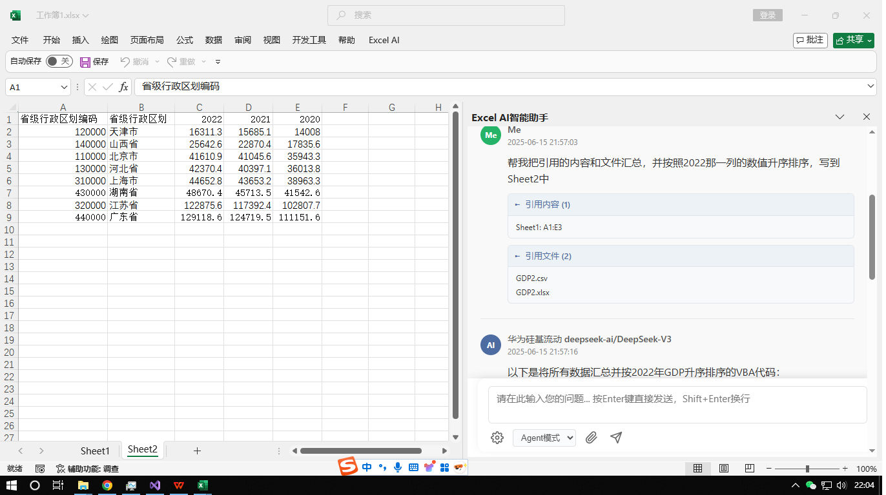
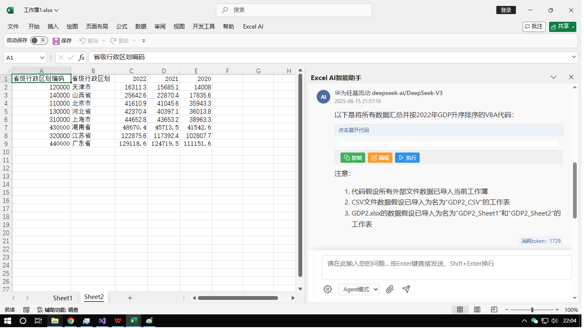
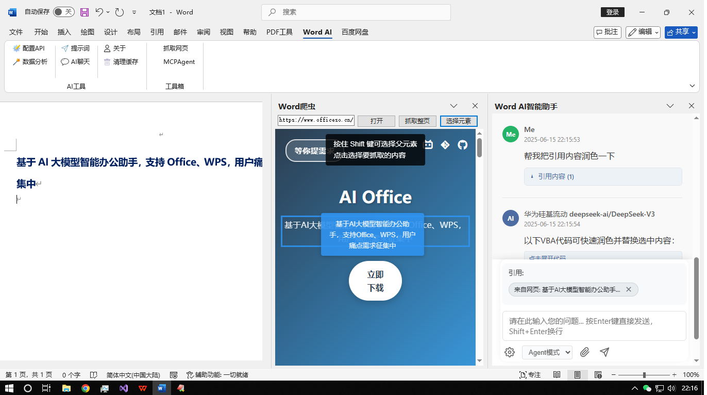
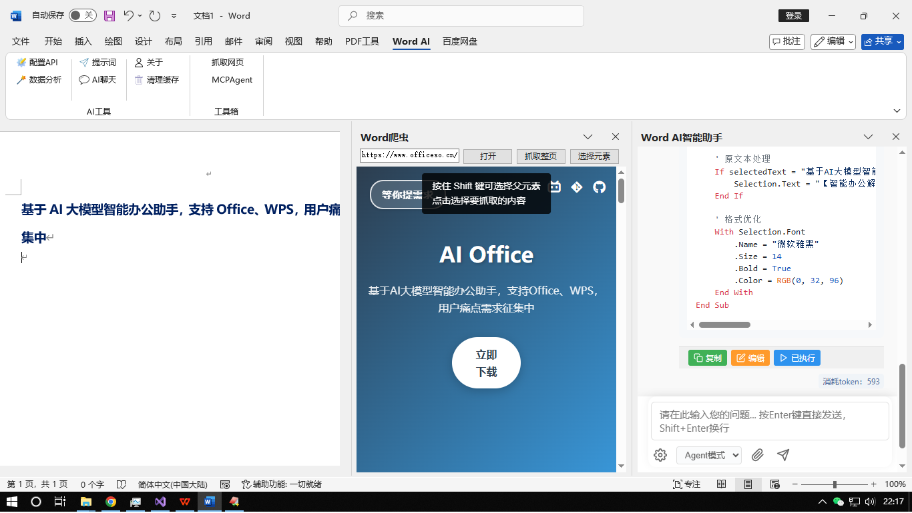

## Office AI插件正式开源

> 大家好，我是君哥，`deepseek`的开源，将我们的大模型水平带到了国际前列，我将毫不犹豫的投入到`ai`的浪潮中给大家分享`ai`知识，和大家一起学习共同进步

插件下载：http://www.officeso.cn/

`Gitee`源码：https://gitee.com/it235/office-ai-agent

`Github`源码：https://github.com/it235/office-ai-agent

## 插件展示

### Excel示例

可引用选择的Sheet或单元格、以及外部Excel文件进行分析问答并整理数据

### Word示例

引用外部网站的数据分析，并将结果插入Word文档中

